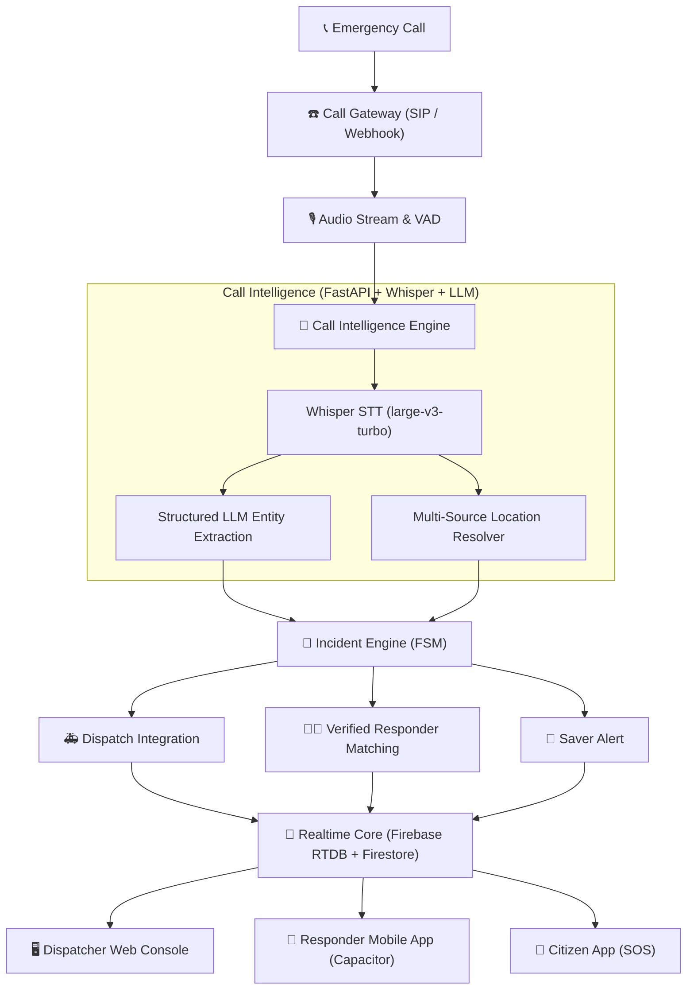

# resQ — Call-First Emergency Response Platform

<div align="center">


[](https://pnpm.io)
[](https://www.typescriptlang.org/)
[](https://react.dev)
[](https://fastapi.tiangolo.com)
[](https://github.com/openai/whisper)
[](https://firebase.google.com)
[](https://capacitorjs.com)

**Universal entry point emergency coordination infrastructure powered by AI speech intelligence, real-time spatial matching, and clinical responder guidance.**

[Architecture](#-system-architecture) • [Key Features](#-key-features) • [Monorepo Structure](#-monorepo-structure) • [Getting Started](#-getting-started) • [Security](#-security--authorization)

</div>

---

## 📞 Universal Product Vision

**resQ** operates without requiring the person in danger or distress to have the resQ mobile application installed. 

The primary entry point is an emergency phone call. When an emergency call reaches the platform:
1. **Call Gateway** intercepts the audio stream (via SIP, Asterisk, FreeSWITCH, or Webhooks).
2. **Call Intelligence Engine** transcribes multilingual speech using local Whisper `large-v3-turbo` models.
3. **Structured Entity Extractor** identifies emergency type, severity, patient symptoms, required skills, and location text.
4. **Multi-Source Location Resolver** calculates precise coordinates and confidence scores.
5. **Incident Engine** triggers parallel emergency service dispatch, verified responder matching with dynamic radius expansion, and community saver alerts.



---

## ⚡ Key Features

### 1. 🧠 Call Intelligence Engine (`services/backend`)
- **Multilingual Speech-to-Text**: Powered by `faster-whisper` running CTranslate2 runtime optimized for Whisper `large-v3-turbo` with automatic language identification.
- **Deterministic AI Extractor**: Converts raw audio transcripts into strict Pydantic JSON schemas (`emergencyType`, `severity`, `patientState`, `bleeding`, `requiredSkills`).
- **Location Resolver**: Fuses telecom metadata, spoken landmarks, and geocoding to compute lat/lng coordinates with confidence scoring.

### 2. 🖥️ Multi-Panel Dispatcher Command Center (`apps/dispatcher-web`)
- **Operations Dashboard**: Designed for high-stress command center environments with dark editorial UI theme.
- **Interactive GIS Map**: Spatial view of active emergency locations, nearby responders, ambulances, and hospital capacity.
- **Live Stream Review**: Displays live audio waveforms, streaming transcripts, confidence scores, and manual confirmation overrides.

### 3. 📱 Verified Responder Mobile App (`apps/responder-app`)
- **Capacitor Native Integration**: Web-first React app wrapped into Android/iOS with native GPS geolocation and push notifications (`FCM`).
- **Dynamic Search Radius**: Responder alerts expand progressively (500m → 1km → 2km → 5km) based on skill compatibility and distance.
- **Voice TTS First-Aid Protocols**: Medically reviewed step-by-step guidance for adult, child, infant, and species scenarios with Web Speech Synthesis playback.

### 4. 🏆 Server-Validated Rewards & Saver Ledger (`functions/`)
- **Audit-Backed Points**: Points and saver badges awarded strictly server-side via Firebase Cloud Functions transactions (`ACCEPTED_INCIDENT`: +10, `ARRIVED_ON_SCENE`: +20, `VERIFIED_FIRST_RESPONSE`: +40, `HANDOFF_COMPLETED`: +30).

---

## 📁 Monorepo Structure

```
resQ/
├── apps/
│   ├── dispatcher-web/        # Next/Vite React Desktop Operations Command Center
│   ├── responder-app/         # React + Capacitor Mobile App for First Responders
│   └── citizen-app/           # React + Capacitor Mobile App for Citizens (SOS)
│
├── services/
│   └── backend/               # Python FastAPI Call Intelligence & Audio Gateway Service
│       ├── app/
│       │   ├── api/v1/        # Endpoints for call processing, transcription, extraction
│       │   └── services/      # Whisper STT, Extraction, Location Resolver, Call Gateway
│       ├── main.py
│       └── requirements.txt
│
├── functions/                 # Firebase Cloud Functions (Node.js/TypeScript)
│   ├── src/rewards/           # Server-validated points & ledger transaction engine
│   └── src/auth/              # Custom user role claims mapping
│
├── packages/
│   ├── types/                 # Shared TypeScript interfaces (Incident, User, Responder, Call)
│   ├── config/                # System constants, Emergency types, Skill matrices, Roles
│   ├── validation/            # Zod validation schemas
│   ├── firebase/              # Firebase SDK initialization, Firestore & RTDB helpers
│   └── ui/                    # Shared UI component library (ResQLogo, Cards, Timeline)
│
├── firebase/                  # Security rules (firestore.rules, database.rules.json, storage.rules)
├── ai/                        # Prompts and JSON schemas for LLM emergency extractions
├── pnpm-workspace.yaml
├── turbo.json
├── package.json
└── README.md
```

---

## 🚀 Getting Started

### Prerequisites
- **Node.js**: `v22.x` or higher
- **pnpm**: `v11.x`
- **Python**: `v3.10` to `v3.14`
- **Git**

### Installation

1. **Clone the repository**:
   ```bash
   git clone https://github.com/sumyaopratar123/Resq.git
   cd Resq
   ```

2. **Install monorepo dependencies**:
   ```bash
   pnpm install
   pnpm approve-builds --all
   ```

3. **Install Python backend dependencies**:
   ```bash
   cd services/backend
   pip install -r requirements.txt
   ```

---

## 🏃 Running the Platform

### 1. Start the FastAPI Call Intelligence Backend
```bash
cd services/backend
python -m uvicorn app.main:app --host 127.0.0.1 --port 8000 --reload
```
*API docs will be live at: `http://localhost:8000/docs`*

### 2. Start Frontends in Development Mode
From the monorepo root:
```bash
pnpm dev
```
- **Dispatcher Web Console**: `http://localhost:3000`
- **Responder Mobile App**: `http://localhost:3001`
- **Citizen SOS App**: `http://localhost:3002`

### 3. Type Checking & Production Build
```bash
# Type check all packages
pnpm check-types

# Build all production targets
pnpm build
```

---

## 🔒 Security & Authorization

- **Firestore Security Rules**: Role-based access control protecting citizen records, responder certifications, and operational transcripts.
- **Realtime Database Security Rules**: Restricts presence and location streams strictly to authenticated responders and assigned dispatchers.
- **Private Storage**: Certification documents are isolated in Firebase Storage with owner-only access.
- **Server-Side Rewards**: Points ledger updates are strictly forbidden from client mutation and enforced by Cloud Functions transactions.

---

## 📜 License

Distributed under the MIT License. See `LICENSE` for more information.
